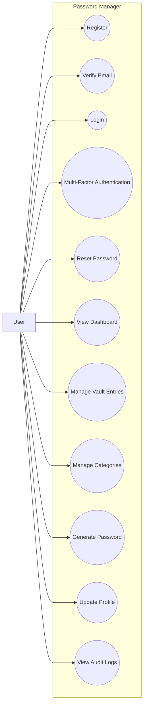
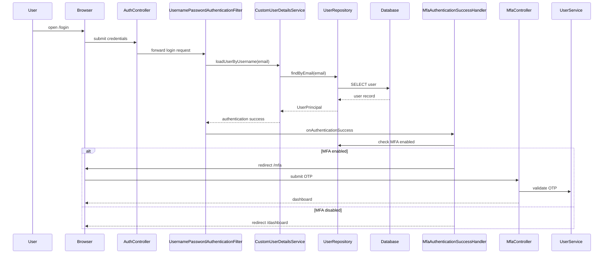
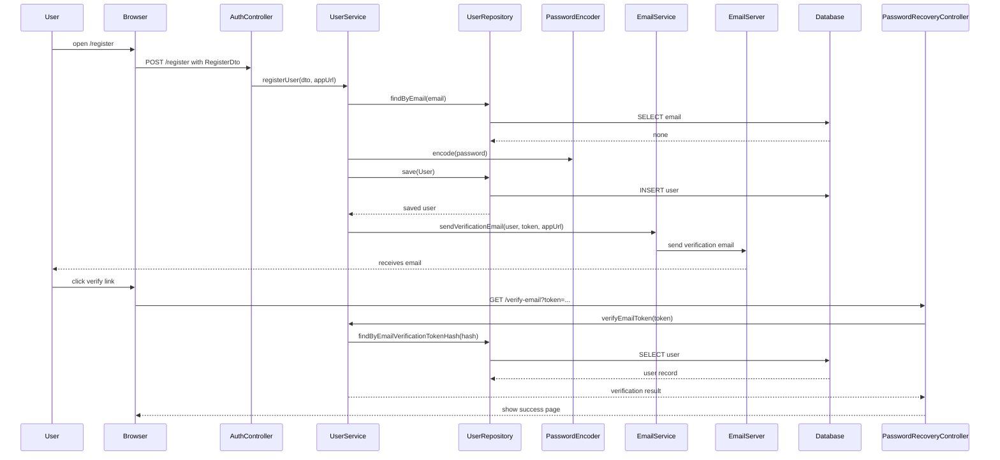
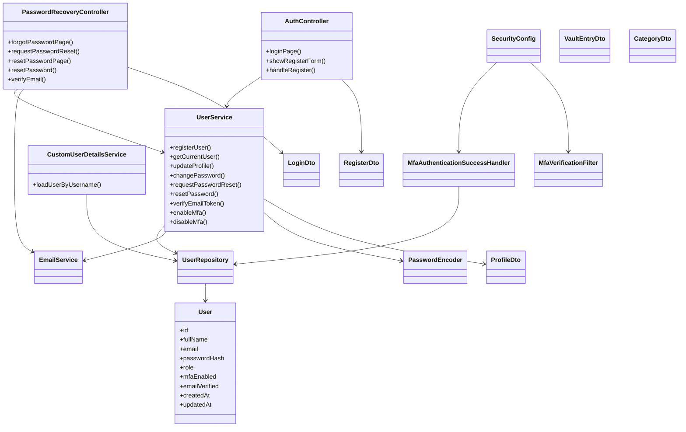
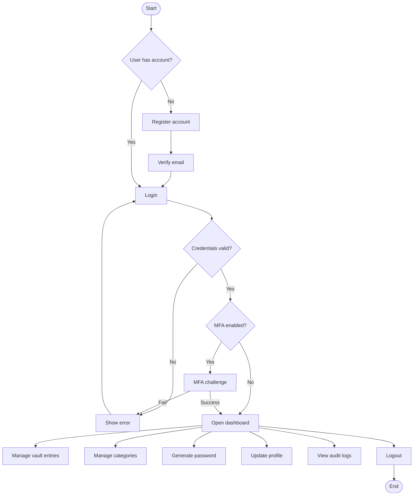

# Password Manager Design Documentation

## 1) Use Case Diagram



---

## 2) Sequence Diagram — Login



---

## 3) Sequence Diagram — Registration



---

## 4) Class Diagram



---

## 5) Activity Diagram — User Workflow



---

## 6) Component Diagram

```mermaid
graph TB
    Browser[User Browser]
    WebApp[Web UI (Thymeleaf)]
    Controllers[Controllers]
    Services[Service Layer]
    Security[Security Layer]
    Repositories[Repository Layer]
    Database[MySQL Database]
    EmailServer[SMTP / Email Service]

    Browser --> WebApp
    WebApp --> Controllers
    Controllers --> Services
    Services --> Repositories
    Repositories --> Database
    Services --> EmailServer
    Security --> Controllers
    Security --> CustomUserDetailsService
    Security --> MfaVerificationFilter
    Security --> MfaAuthenticationSuccessHandler
    CustomUserDetailsService --> Repositories
    Services --> PasswordEncoder[Password Encoder]
```

---

## 7) Deployment Diagram

```mermaid
graph LR
    Browser[User Browser]
    AppServer[Spring Boot App\n(Java 26, Spring Boot 4.0.5)]
    MySQL[MySQL Database]
    SMTP[SMTP / Email Server]

    Browser -->|HTTPS / HTTP| AppServer
    AppServer -->|JDBC| MySQL
    AppServer -->|SMTP| SMTP
    AppServer -->|Session / Cookies| Browser
```
